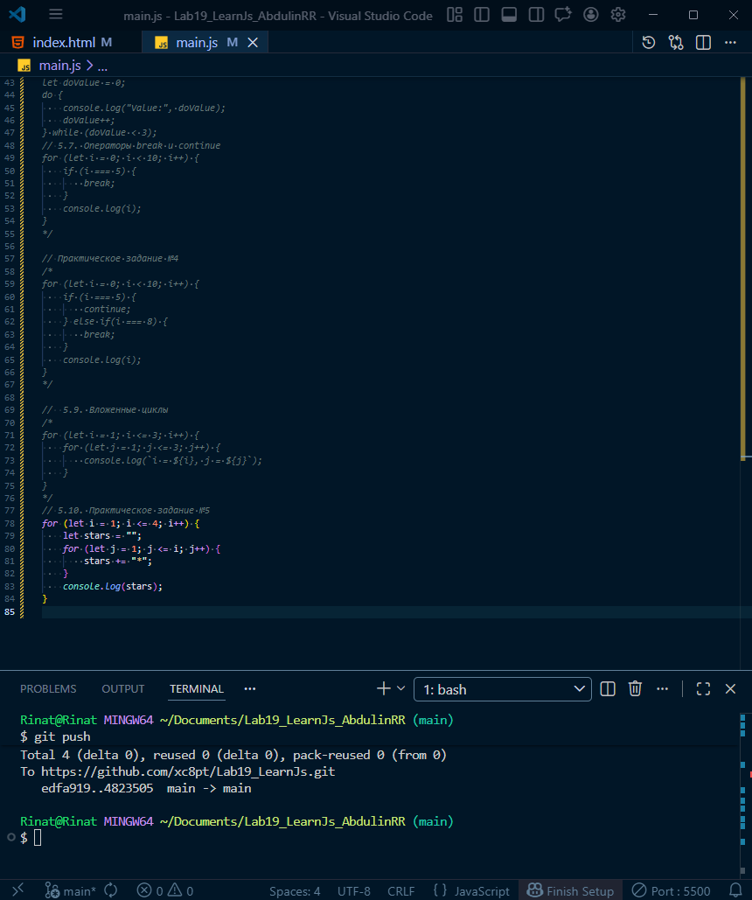
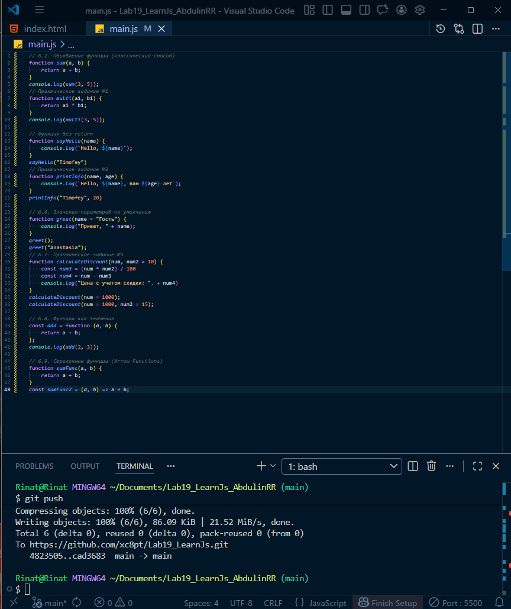
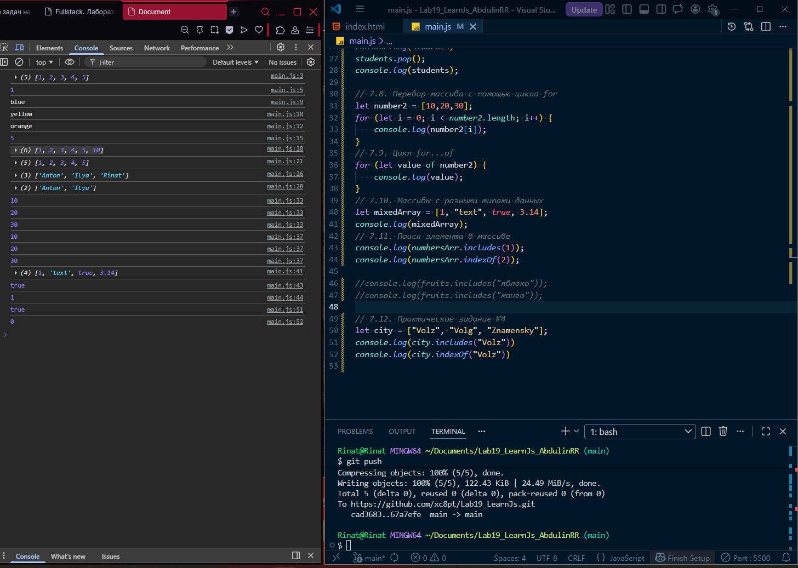
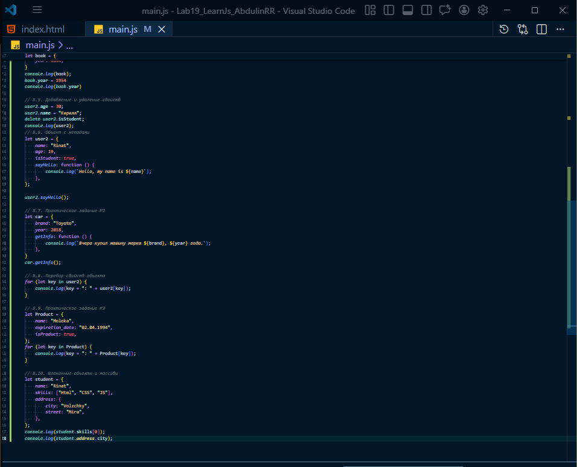
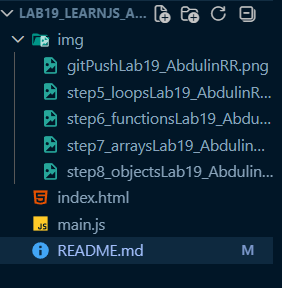

# Лабораторная работа №19. Введение в JavaScript. Сравнение с C#

[x] Познакомиться с языком программирования JavaScript;
[x] Понять его место в web-разработке;
[x] Сравнить базовые концепции JavaScript и C#;
[x] Научиться запускать JavaScript-код в браузере и через Node.js.

## Основная информация
**ФИО:** *Абдулин Ринат Рушанович*
**Группа:** *ИСП-233*
**Дата:** *18.03.2026*

## Описание (что изучили)
- Циклы в JavaScript

- Функции в JavaScript

- Массивы в JavaScript

- Объекты в JavaScript

## Структура проекта
